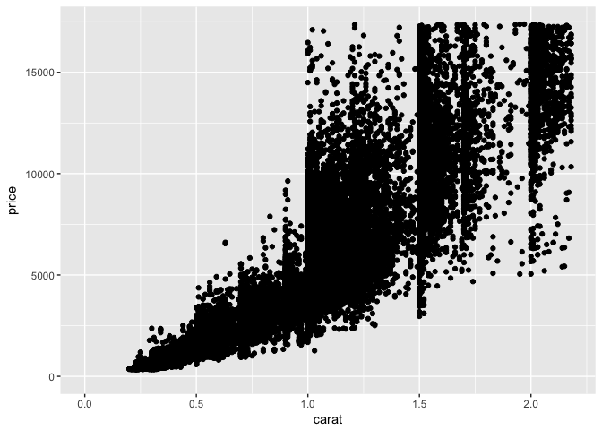

Lesson 6: Problem Set: Working with Two Variables
================
Josh Goldberg
October 15, 2017

#### *Load Libraries*

``` r
library(ggplot2)
library(dplyr)
```

    ## Warning: package 'dplyr' was built under R version 3.4.2

    ## 
    ## Attaching package: 'dplyr'

    ## The following objects are masked from 'package:stats':
    ## 
    ##     filter, lag

    ## The following objects are masked from 'package:base':
    ## 
    ##     intersect, setdiff, setequal, union

``` r
library(gridExtra)
```

    ## 
    ## Attaching package: 'gridExtra'

    ## The following object is masked from 'package:dplyr':
    ## 
    ##     combine

#### **1. Price vs. Length**

In this problem set, you'll continue to explore the diamonds data set. Your first task is to create a scatterplot of price vs x using the ggplot syntax.

``` r
ggplot(aes(x = x, y = price), data = diamonds) +
  geom_point() +
  xlab("Length in mm (0–10.74)") +
  ylab("Price in US Dollars ($326 - $18,823)") +
  ggtitle("Diamond Price vs. Length", subtitle = "Positive Exponential Relationship; Some Outliers")
```


#### **2. Findings**

What are your observations about the scatterplot of price vs. x? There is an exponential positive relationship between price and length of a diamond. Most of the lengths fall between ~3 and ~6.5 mm. There are some diamonds outside the bulk that are a lower price relative to the rest of the diamonds.

#### **3. Correlations**

What is the correlation between price and x (length), price and y (width), price and z (depth in mm, which is different than total depth percentage)? Round to two decimals.

``` r
# Price vs. x
cor.test(diamonds$price, diamonds$x)
```

    ## 
    ##  Pearson's product-moment correlation
    ## 
    ## data:  diamonds$price and diamonds$x
    ## t = 440.16, df = 53938, p-value < 2.2e-16
    ## alternative hypothesis: true correlation is not equal to 0
    ## 95 percent confidence interval:
    ##  0.8825835 0.8862594
    ## sample estimates:
    ##       cor 
    ## 0.8844352

``` r
# Price vs. y
cor.test(diamonds$price, diamonds$y)
```

    ## 
    ##  Pearson's product-moment correlation
    ## 
    ## data:  diamonds$price and diamonds$y
    ## t = 401.14, df = 53938, p-value < 2.2e-16
    ## alternative hypothesis: true correlation is not equal to 0
    ## 95 percent confidence interval:
    ##  0.8632867 0.8675241
    ## sample estimates:
    ##       cor 
    ## 0.8654209

``` r
# Price vs. z
cor.test(diamonds$price, diamonds$z)
```

    ## 
    ##  Pearson's product-moment correlation
    ## 
    ## data:  diamonds$price and diamonds$z
    ## t = 393.6, df = 53938, p-value < 2.2e-16
    ## alternative hypothesis: true correlation is not equal to 0
    ## 95 percent confidence interval:
    ##  0.8590541 0.8634131
    ## sample estimates:
    ##       cor 
    ## 0.8612494

#### **4. Adjustments - Price vs. Depth**

Create a simple scatter plot of price vs depth.

``` r
ggplot(aes(x = depth, y = price), data = diamonds) +
  geom_point(alpha = 1/100) +
  xlab("Total Depth Percentage = z / mean(x, y) = 2 * z / (x + y) (43–79)") +
  ylab("Price in US Dollars ($326 - $18,823)") +
  ggtitle("Diamond Price vs. Depth") +
  scale_x_continuous(breaks = seq(50, 80, 2))
```


#### **5. Typical Depth Range**

Based on the scatterplot of price vs. depth, most diamonds are between what values of depth? 59-64.

#### **6. Correlation - Price vs. Depth**

``` r
# What's the correlation of price vs. total depth percentage?
cor.test(diamonds$price, diamonds$depth)
```

    ## 
    ##  Pearson's product-moment correlation
    ## 
    ## data:  diamonds$price and diamonds$depth
    ## t = -2.473, df = 53938, p-value = 0.0134
    ## alternative hypothesis: true correlation is not equal to 0
    ## 95 percent confidence interval:
    ##  -0.019084756 -0.002208537
    ## sample estimates:
    ##        cor 
    ## -0.0106474

Based on the correlation coefficient would you use depth to predict the price of a diamond? Why? No, due to the correlastion coefficient (-0.0106474) being weak.

#### **8. Price vs. Carat**

Create a scatterplot of price vs carat and omit the top 1% of price and carat values.

``` r
ggplot(aes(x = carat, y = price), data = diamonds) +
  geom_point() +
  xlim(0, quantile(diamonds$carat, 0.99)) +
  ylim(0, quantile(diamonds$price, 0.99))
```

    ## Warning: Removed 926 rows containing missing values (geom_point).


#### **9. Price vs. Volume**

Create a scatterplot of price vs. volume (x \* y \* z). This is a very rough approximation for a diamond's volume. Create a new variable for volume in the diamonds data frame. This will be useful in a later exercise. Don't make any adjustments to the plot just yet.

``` r
diamonds$volume <- with(diamonds, x * y * z)

ggplot(aes(x = volume, y = price), data = diamonds) +
  geom_point() +
  xlab("Volume") +
  ylab("Price in US Dollars ($326 - $18,823)") +
  ggtitle("Diamond Price vs. Volume")
```



#### **10. Findings - Price vs. Volume**

What are your observations from the price versus volume plot? There appears to essentially be no relationship. The data is stacked in a small range with some outliers.

#### **11. Correlations on Subsets**

``` r
#What's the correlation of price and volume? Exclude diamonds that have a volume of 0 or that are greater than or equal to 800. Round to two decimals.

with(subset(diamonds, volume > 0 & volume < 800), 
            cor.test(price, volume))
```

    ## 
    ##  Pearson's product-moment correlation
    ## 
    ## data:  price and volume
    ## t = 559.19, df = 53915, p-value < 2.2e-16
    ## alternative hypothesis: true correlation is not equal to 0
    ## 95 percent confidence interval:
    ##  0.9222944 0.9247772
    ## sample estimates:
    ##       cor 
    ## 0.9235455

#### **12. Adjustments - Price vs. Volume**

Subset the data to exclude diamonds with a volume greater than or equal to 800. Also, exclude diamonds with a volume of 0. Adjust the transparency of the points and add a linear model to the plot. (See the Instructor Notes or look up the documentation of geom\_smooth() for more details about smoothers. We encourage you to think about this next question and to post your thoughts in the discussion section.

``` r
ggplot(aes(x = volume, y = price), 
       data = subset(diamonds, volume > 0 & volume < 800)) +
  xlab("Volume") +
  ylab("Price in US Dollars ($326 - $18,823)") +
  ggtitle("Diamond Price vs. Volume", subtitle = "Excludes: 0 > Volume >= 800") +
  geom_point(alpha = 0.05) +
  geom_smooth(method = "lm")
```


##### *12.1 Reflect*

Do you think this would be a useful model to estimate the price of diamonds? Why or why not? There seems to be a strong positive relationship between price and volume once outliers are excluded. But why are such outliers in existence? The answer could be telling of further details. Nonetheless, the majority of observations fall within a particularly linear ban of values based on price and volume. This essentially indicates that the bigger a diamond, the more expensive it costs, generally speaking. But there are clearly exceptions in the scatterplot to this rule. There may be a better alternative for predicting diamond prices.

#### **13. Mean Price by Clarity**

Use the function dplyr package to create a new data frame containing info on diamonds by clarity. Name the data frame diamondsByClarity.

The data frame should contain the following variables in this order:

       (1) mean_price
       (2) median_price
       (3) min_price
       (4) max_price
       (5) n

where n is the number of diamonds in each level of clarity.

``` r
diamondsByClarity <- diamonds %>%
  group_by(clarity) %>%
  summarise(mean_price = mean(price),
            median_price = median(price),
            min_price = min(price),
            max_price = max(price),
            n = n()) %>%
  arrange(clarity)
```

#### **14. Bar Charts of Mean Price**

We’ve created summary data frames with the mean price by clarity and color. You can run the code in R to verify what data is in the variables diamonds\_mp\_by\_clarity and diamonds\_mp\_by\_color.

Your task is to write additional code to create two bar plots on one output image using the grid.arrange() function from the package gridExtra.

``` r
diamonds_mp_by_clarity <- diamonds %>%
  group_by(clarity) %>%
  summarise(mean_price = mean(price)) %>%
  arrange(clarity)

diamonds_mp_by_color <- diamonds %>%
  group_by(color) %>%
  summarise(mean_price = mean(price)) %>%
  arrange(color)

diamonds_mp_by_color$color <- factor(diamonds_mp_by_color$color, 
                                     levels = c("J", "I", "H", "G", "F", "E", "D"))
diamonds_mp_by_clarity$clarity <- factor(diamonds_mp_by_clarity$clarity, 
                                     levels = c("I1", "SI1", "SI2", "VS1", "VS2", "VVS1", "VVS2", "IF" ))

plot1 <- ggplot(aes(x = clarity, y = mean_price, fill = clarity), data = diamonds_mp_by_clarity) +
  xlab("Clairty: I1 (worst) to IF (best)") +
  ylab("Average Price in US Dollars ($326 - $18,823)") +
  ggtitle("Average Diamond Price vs. Clarity") +
  geom_bar(colour = "white", stat = "identity") +
  guides(fill = FALSE)

plot2 <- ggplot(aes(x = color, y = mean_price, fill = color), data = diamonds_mp_by_color) +
  xlab("Color: from J (worst) to D (best)") +
  ylab("Average Price in US Dollars ($326 - $18,823)") +
  ggtitle("Average Diamond Price vs. Color") +
  geom_bar(colour = "white", stat = "identity") +
  guides(fill = FALSE)

grid.arrange(plot1, plot2, nrow = 1)
```


##### *14.1 Findings*

What do you notice in each of the bar charts for mean price by clarity and mean price by color? Mean price by clarity seems inconsistent with intuition; the better clarity diamonds have a lower mean price. Moreover, S12 has a spike in average price. Color holds the same pattern of inverse relationship between quality and price.
